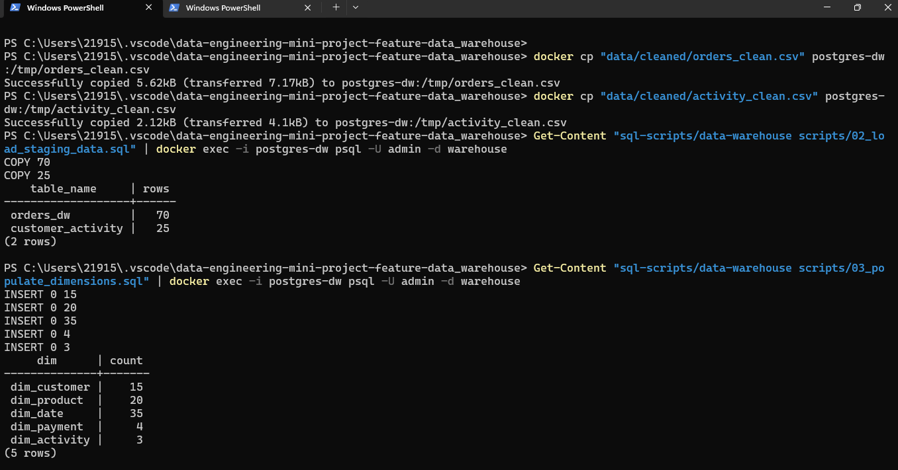
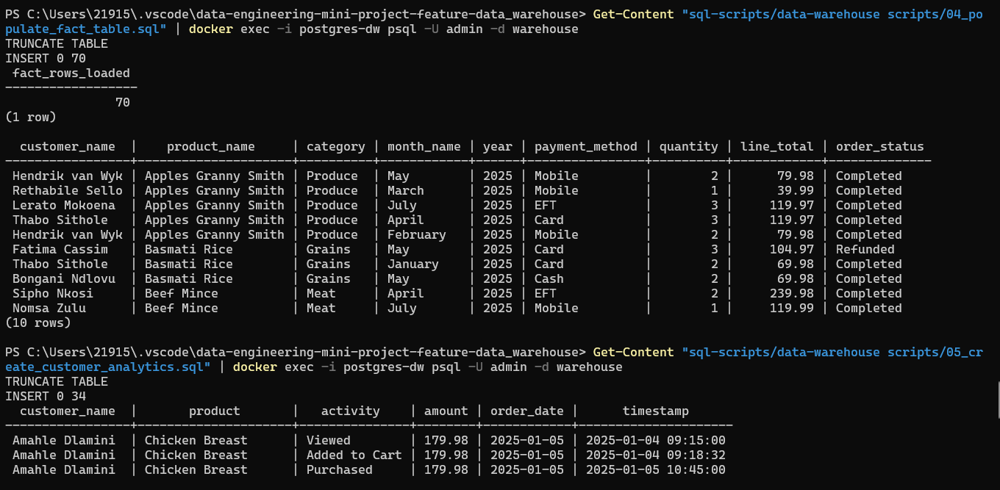
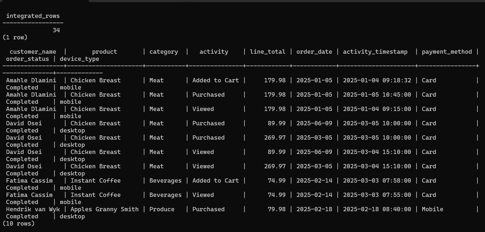
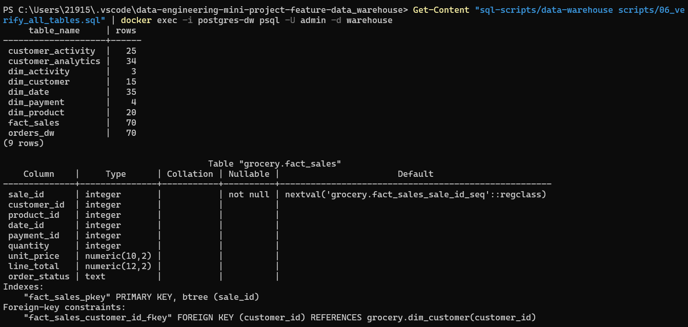
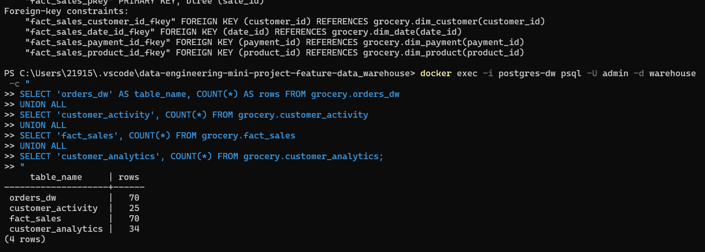
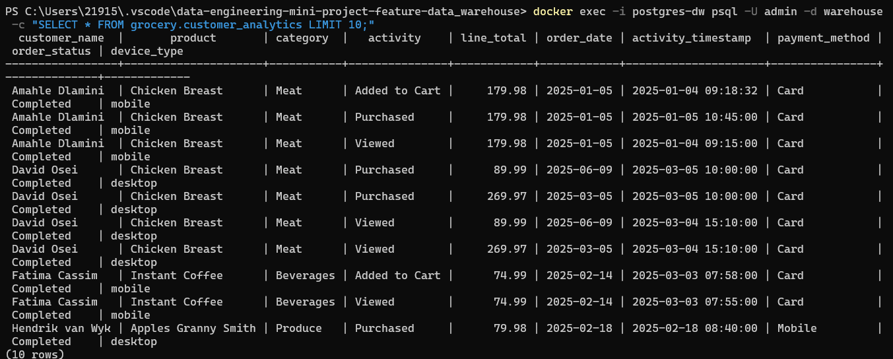
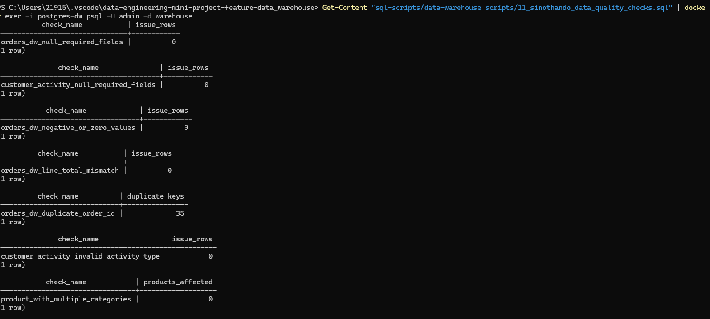
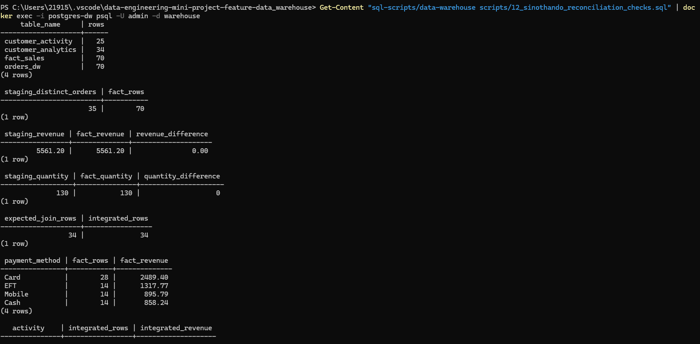

# Data Integration Contribution Report (Sinothando Masiki)

## 1. Role and Objective
My role in this mini project was **Data Integration** in the OLAP stage. I focused on integrating cleaned OLTP data from MySQL and MongoDB into PostgreSQL so that it can be used for analysis and dashboarding.

The main objectives of my work were:
- populate star-schema tables (dimensions and fact)
- create a unified analytics table (`customer_analytics`)
- make SQL scripts reproducible and safe to rerun

This directly supports the pipeline architecture: **OLTP -> ETL -> OLAP -> BI** and the rubric criteria for integration quality and report evidence.

---

## 2. Files I Worked On
I worked on:
- `sql-scripts/data-warehouse scripts/08_sinothando_populate_dimensions.sql`
- `sql-scripts/data-warehouse scripts/09_sinothando_populate_fact_table.sql`
- `sql-scripts/data-warehouse scripts/10_sinothando_create_customer_analytics.sql`
- `sql-scripts/data-warehouse scripts/11_sinothando_data_quality_checks.sql`
- `sql-scripts/data-warehouse scripts/12_sinothando_reconciliation_checks.sql`

My updates are tagged with:

```sql
-- Collaborative Update: Sinothando Masiki (data integration refinements)
```

---

## 3. What I Implemented

### 3.1 Dimension Population Improvements (`08_sinothando_populate_dimensions.sql`)
I validated and refined dimension loads for:
- `dim_customer`
- `dim_product`
- `dim_date`
- `dim_payment`
- `dim_activity`

Key enhancement: I added safer deduplication for product-category pairs using `NOT EXISTS`, so repeated script runs do not create duplicates.

```sql
INSERT INTO grocery.dim_product(product_name, category)
SELECT DISTINCT o.product, o.category
FROM grocery.orders_dw o
WHERE NOT EXISTS (
    SELECT 1
    FROM grocery.dim_product dp
    WHERE dp.product_name = o.product
      AND COALESCE(dp.category, '') = COALESCE(o.category, '')
);
```

### 3.2 Fact Table Load Hardening (`09_sinothando_populate_fact_table.sql`)
I improved fact loading for rerun safety and cleaner joins by:
- truncating `fact_sales` before loading
- resetting identity values for consistent reruns
- matching product using both product name and category

```sql
TRUNCATE TABLE grocery.fact_sales RESTART IDENTITY;

INSERT INTO grocery.fact_sales(
    customer_id, product_id, date_id, payment_id,
    quantity, unit_price, line_total, order_status
)
SELECT
    dc.customer_id,
    dp.product_id,
    dd.date_id,
    dpm.payment_id,
    o.quantity,
    o.unit_price,
    o.line_total,
    o.order_status
FROM grocery.orders_dw o
JOIN grocery.dim_customer dc ON dc.customer_name = o.customer_name
JOIN grocery.dim_product dp ON dp.product_name = o.product
                          AND COALESCE(dp.category, '') = COALESCE(o.category, '')
JOIN grocery.dim_date dd ON dd.full_date = o.order_date
JOIN grocery.dim_payment dpm ON dpm.payment_method = o.payment_method;
```

### 3.3 Integrated Table Creation (`10_sinothando_create_customer_analytics.sql`)
I implemented integration of transactional and behavioral data into `customer_analytics` by:
- truncating the target table before insert
- joining star-schema tables with `customer_activity`
- validating assignment-required join pattern

```sql
TRUNCATE TABLE grocery.customer_analytics;

INSERT INTO grocery.customer_analytics(
    customer_name, product, category, activity, line_total,
    order_date, activity_timestamp, payment_method, order_status, device_type
)
SELECT DISTINCT
    dc.customer_name,
    dp.product_name,
    dp.category,
    da.activity_type,
    fs.line_total,
    dd.full_date AS order_date,
    ca.activity_timestamp,
    dpm.payment_method,
    fs.order_status,
    ca.device_type
FROM grocery.fact_sales fs
JOIN grocery.dim_customer dc ON fs.customer_id = dc.customer_id
JOIN grocery.dim_product dp ON fs.product_id = dp.product_id
JOIN grocery.dim_date dd ON fs.date_id = dd.date_id
JOIN grocery.dim_payment dpm ON fs.payment_id = dpm.payment_id
JOIN grocery.customer_activity ca
  ON dc.customer_name = ca.customer_name
 AND dp.product_name = ca.product
 AND COALESCE(dp.category, '') = COALESCE(ca.category, '')
JOIN grocery.dim_activity da ON ca.activity = da.activity_type;
```

---

## 4. Verification and Evidence
To prove successful execution, I ran all integration scripts from command line and captured output screenshots.

### Screenshot 1: Staging Data Load
Successful load from cleaned CSV files into PostgreSQL (`orders_dw = 70`, `customer_activity = 25`).



### Screenshot 2: Dimension Population
Dimension tables populated successfully (`dim_customer = 15`, `dim_product = 20`, `dim_date = 35`, `dim_payment = 4`, `dim_activity = 3`).



### Screenshot 3: Fact Table Load
Fact table loaded through star-schema joins (`fact_sales = 70`) with sample integrated rows.



### Screenshot 4: Customer Analytics Integration
Integrated table created successfully (`customer_analytics = 34`) with sample output.



### Screenshot 5: Warehouse Verification
Final verification confirms table counts and referential integrity structure in the warehouse.



### Screenshot 6: End-to-End Count Check
Final summary query confirms complete OLTP-to-OLAP integration across staging, fact, and analytics tables.



### Screenshot 7: Data quality governance evidence
Query displays nulls, invalid values, mismatches, duplicates, orphan records.



### Screenshot 6: Reconciliation evidence 
Query displays counts/totals across staging, fact, integrated layers.



This evidence demonstrates:
- successful ETL-to-OLAP loading
- working star-schema joins
- successful MySQL + MongoDB integration
- reproducible command-line execution

---

## 5. Business Value of My Contribution
My integration work transformed separate operational and behavioral datasets into one analytics-ready structure. This supports:
- customer behavior vs purchase analysis
- product-level performance tracking
- trend analysis over time
- dashboard-ready reporting in Metabase

Without this integration layer, the BI dashboards would not provide a unified customer and product view.

---

## 6. Conclusion
I completed the Data Integration component by refining and executing SQL scripts that populate dimensions, load fact data, and create the final integrated analytics table. My focus was on correctness, join integrity, and rerun safety (idempotent loading), with full execution evidence included for assessment.